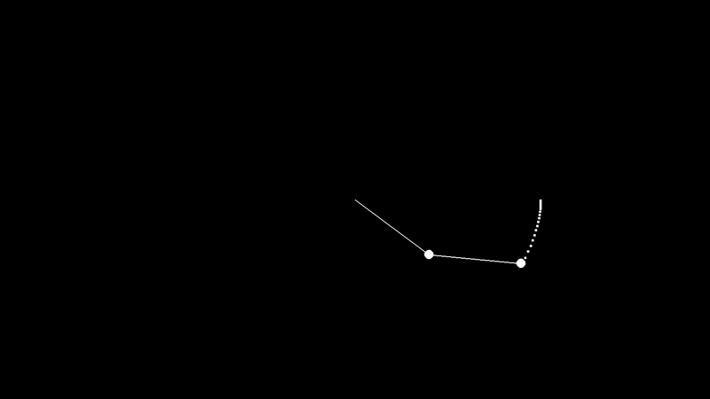

# Double-Pendulum-Simulation
## Physics double pendulum simulation using pygame, Lagrangian equations of motion, and RK4 integration


# Run
To run the project, make sure to install the dependencies in `requirements.txt`. You can create a virtual environment using the command
```
cd path\to\project
python -m venv name_of_venv
```
Use the command
```
name_of_venv\Scripts\activate
```
To activate the virtual environment, and then proceed with
```
python -m pip install -r requirements.txt
```
### If you think the creation of a venv is unnecessary, you can directly use the command above to install the necessary packages

## Code:
### Parameters
```py
# Base pendulum parameters
BASE_LENGTH = int(WIDTH * 0.1)
PENDULUM_WIDTH_RATIO = 0.002
BOB_RADIUS = int(WIDTH * 0.01)
```
`BASE_LENGTH` sets the base relationship of length of the pendulum and dynamically changes with resolution.
`PENDULUM_WIDTH_RATIO` is the factor for the width of the pendulum rod, smaller values will result in thinner rods.
`BOB_RADIUS` is the base relationship for the radius of the pendulums' bobs, and again, dynamically scales with resolution.
```py
# Pendulum parameters
FIRST_P_LENGTH = BASE_LENGTH
SECOND_P_LENGTH = BASE_LENGTH
FIRST_P_WIDTH = int(WIDTH * PENDULUM_WIDTH_RATIO)
SECOND_P_WIDTH = int(WIDTH * PENDULUM_WIDTH_RATIO)
FIRST_P_THETA = math.pi/2
SECOND_P_THETA = math.pi/2

FIRST_P_MASS = 1
SECOND_P_MASS = 1
FIRST_THETA_DOT = 0
SECOND_THETA_DOT = 0

FIRST_P_COLOR = (255, 255, 255)
SECOND_P_COLOR = (255, 255, 255)

# Pendulum constants
GRAVITY = 9.81
DAMPING_FACTOR = 1
```
Length of the first (pendulum at the pivot) and second pendulum (pendulum attached to the first), respectively.:
```py
FIRST_P_LENGTH = BASE_LENGTH
SECOND_P_LENGTH = BASE_LENGTH
```
Width of the first and second pendulums, respectively:
```py
FIRST_P_WIDTH = int(WIDTH * PENDULUM_WIDTH_RATIO)
SECOND_P_WIDTH = int(WIDTH * PENDULUM_WIDTH_RATIO)
```
Initial angles of the first and second pendulums in radians. $$x^{\circ} = \frac{x\pi}{180}\quad\text{radians}$$ to convert degrees to radians:
```py
FIRST_P_THETA = math.pi/2
SECOND_P_THETA = math.pi/2
```
Simulated mass of the pendulums:
```py
FIRST_P_MASS = 1
SECOND_P_MASS = 1
```
Initial angular velocity of the pendulums ($$\dot{\theta}$$, derivative of theta with respect to time):
```py
FIRST_THETA_DOT = 0
SECOND_THETA_DOT = 0
```
Colors of the pendulums and their bobs:
```py
FIRST_P_COLOR = (255, 255, 255)
SECOND_P_COLOR = (255, 255, 255)
```
Gravity in $$\frac{m}{s^2}$$, and a damping factor (1 leads results in perpetual motion, anything less like 0.995 slows down the pendulum with time):
```py
GRAVITY = 9.81
DAMPING_FACTOR = 1
```
### Physics
The function takes in `theta1`, `theta2`, `theta1_dot`, `theta2_dot`. These are the initial angles and angular velocities of the pendulums. The function returns angular acceleration $$\ddot{\theta_{1}}$$ and $$\ddot{\theta_{2}}$$, the second derivatives of theta with respect to time:
```py
def compute_accelerations(theta1, theta2, theta1_dot, theta2_dot):
    num1 = -GRAVITY * (2 * FIRST_P_MASS + SECOND_P_MASS) * math.sin(theta1)
    num2 = -SECOND_P_MASS * GRAVITY * math.sin(theta1 - 2 * theta2)
    num3 = -2 * math.sin(theta1 - theta2) * SECOND_P_MASS
    num4 = theta2_dot ** 2 * SECOND_P_LENGTH + theta1_dot ** 2 * FIRST_P_LENGTH * math.cos(theta1 - theta2)
    den = FIRST_P_LENGTH * (2 * FIRST_P_MASS + SECOND_P_MASS - SECOND_P_MASS * math.cos(2 * theta1 - 2 * theta2))
    theta1_ddot = (num1 + num2 + num3 * num4) / den

    num5 = 2 * math.sin(theta1 - theta2)
    num6 = (theta1_dot ** 2 * FIRST_P_LENGTH * (FIRST_P_MASS + SECOND_P_MASS))
    num7 = GRAVITY * (FIRST_P_MASS + SECOND_P_MASS) * math.cos(theta1)
    num8 = theta2_dot ** 2 * SECOND_P_LENGTH * SECOND_P_MASS * math.cos(theta1 - theta2)
    den2 = SECOND_P_LENGTH * (2 * FIRST_P_MASS + SECOND_P_MASS - SECOND_P_MASS * math.cos(2 * theta1 - 2 * theta2))
    theta2_ddot = (num5 * (num6 + num7 + num8)) / den2

    return theta1_ddot, theta2_ddot
```
Parts of the numerator for the first pendulum's angular acceleration equation:
```py
    num1 = -GRAVITY * (2 * FIRST_P_MASS + SECOND_P_MASS) * math.sin(theta1)
    num2 = -SECOND_P_MASS * GRAVITY * math.sin(theta1 - 2 * theta2)
    num3 = -2 * math.sin(theta1 - theta2) * SECOND_P_MASS
    num4 = theta2_dot ** 2 * SECOND_P_LENGTH + theta1_dot ** 2 * FIRST_P_LENGTH * math.cos(theta1 - theta2)
```
Denominator of the first pendulum's angular acceleration equation:
```py
    den = FIRST_P_LENGTH * (2 * FIRST_P_MASS + SECOND_P_MASS - SECOND_P_MASS * math.cos(2 * theta1 - 2 * theta2))
```
Piece together the equation:
```py
    theta1_ddot = (num1 + num2 + num3 * num4) / den
```
Same but for the second pendulum (meaning different equations, yay):
```py
    num5 = 2 * math.sin(theta1 - theta2)
    num6 = (theta1_dot ** 2 * FIRST_P_LENGTH * (FIRST_P_MASS + SECOND_P_MASS))
    num7 = GRAVITY * (FIRST_P_MASS + SECOND_P_MASS) * math.cos(theta1)
    num8 = theta2_dot ** 2 * SECOND_P_LENGTH * SECOND_P_MASS * math.cos(theta1 - theta2)
    den2 = SECOND_P_LENGTH * (2 * FIRST_P_MASS + SECOND_P_MASS - SECOND_P_MASS * math.cos(2 * theta1 - 2 * theta2))
    theta2_ddot = (num5 * (num6 + num7 + num8)) / den2
```
Returns both accelerations as a tuple:
```py
    return theta1_ddot, theta2_ddot
```


Runge-Kutta-4th-Order (RK4) numerical integration technique to approximate theta from angular acceleration (second order ordinary differential equation (ODE)). Was too lazy to search and study how any of this works, but hey, it does! `new_theta1_dot *= damping` and `new_theta2_dot *= damping` apply damping by multiplying it with the damping factor:
```py
def rk4_step(damping, theta1, theta2, theta1_dot, theta2_dot, dt):
    # Initial accelerations
    a1, b1 = compute_accelerations(theta1, theta2, theta1_dot, theta2_dot)
    
    # Compute k1
    k1_theta1_dot = dt * a1
    k1_theta2_dot = dt * b1
    k1_theta1 = dt * theta1_dot
    k1_theta2 = dt * theta2_dot
    
    # Compute k2
    a2, b2 = compute_accelerations(theta1 + 0.5 * k1_theta1, theta2 + 0.5 * k1_theta2, theta1_dot + 0.5 * k1_theta1_dot, theta2_dot + 0.5 * k1_theta2_dot)
    k2_theta1_dot = dt * a2
    k2_theta2_dot = dt * b2
    k2_theta1 = dt * (theta1_dot + 0.5 * k1_theta1_dot)
    k2_theta2 = dt * (theta2_dot + 0.5 * k1_theta2_dot)

    # Compute k3
    a3, b3 = compute_accelerations(theta1 + 0.5 * k2_theta1, theta2 + 0.5 * k2_theta2, theta1_dot + 0.5 * k2_theta1_dot, theta2_dot + 0.5 * k2_theta2_dot)
    k3_theta1_dot = dt * a3
    k3_theta2_dot = dt * b3
    k3_theta1 = dt * (theta1_dot + 0.5 * k2_theta1_dot)
    k3_theta2 = dt * (theta2_dot + 0.5 * k2_theta2_dot)

    # Compute k4
    a4, b4 = compute_accelerations(theta1 + k3_theta1, theta2 + k3_theta2, theta1_dot + k3_theta1_dot, theta2_dot + k3_theta2_dot)
    k4_theta1_dot = dt * a4
    k4_theta2_dot = dt * b4
    k4_theta1 = dt * (theta1_dot + k3_theta1_dot)
    k4_theta2 = dt * (theta2_dot + k3_theta2_dot)

    # Final values
    new_theta1_dot = theta1_dot + (1/6) * (k1_theta1_dot + 2*k2_theta1_dot + 2*k3_theta1_dot + k4_theta1_dot)
    new_theta2_dot = theta2_dot + (1/6) * (k1_theta2_dot + 2*k2_theta2_dot + 2*k3_theta2_dot + k4_theta2_dot)
    new_theta1 = theta1 + (1/6) * (k1_theta1 + 2*k2_theta1 + 2*k3_theta1 + k4_theta1)
    new_theta2 = theta2 + (1/6) * (k1_theta2 + 2*k2_theta2 + 2*k3_theta2 + k4_theta2)

    # Damping
    new_theta1_dot *= damping
    new_theta2_dot *= damping
    
    return new_theta1, new_theta2, new_theta1_dot, new_theta2_dot
```
Pendulum class:
```py
class Pendulum:
    def __init__(self, length, theta, mass, color, width, x_pos, y_pos):
        self.length = length
        self.width = width
        self.theta = theta
        self.mass = mass
        self.color = color
        self.x_pos = x_pos
        self.y_pos = y_pos
        self.end_x = self.x_pos + self.length * math.sin(self.theta)
        self.end_y = self.y_pos + self.length * math.cos(self.theta)

    def update_position(self, theta):
        self.theta = theta
        self.end_x = self.x_pos + self.length * math.sin(self.theta)
        self.end_y = self.y_pos + self.length * math.cos(self.theta)

    def draw(self):
        pygame.draw.line(screen, self.color, (self.x_pos, self.y_pos), (self.end_x, self.end_y), self.width)
        self.circ = pygame.draw.circle(screen, self.color, (self.end_x, self.end_y), BOB_RADIUS)
```
Initialization parameters, defining the length, angle, mass, color, width, x position of pivot and the y position of the pivot respectively.:
```py
    def __init__(self, length, theta, mass, color, width, x_pos, y_pos):
        self.length = length
        self.width = width
        self.theta = theta
        self.mass = mass
        self.color = color
        self.x_pos = x_pos
        self.y_pos = y_pos
        self.end_x = self.x_pos + self.length * math.sin(self.theta)
        self.end_y = self.y_pos + self.length * math.cos(self.theta)
```
Some trigonometry to calculate the endpoint positions of the pendulums. We add the y position of the pivot rather than subtract because Pygame's coordinate system inverts the y axis... for whatever reason.:
```py
        self.end_x = self.x_pos + self.length * math.sin(self.theta)
        self.end_y = self.y_pos + self.length * math.cos(self.theta)
```
Update the position with the same trig:
```py
    def update_position(self, theta):
        self.theta = theta
        self.end_x = self.x_pos + self.length * math.sin(self.theta)
        self.end_y = self.y_pos + self.length * math.cos(self.theta)
```
Draw the pendulum and its bob:
```py
    def draw(self):
        pygame.draw.line(screen, self.color, (self.x_pos, self.y_pos), (self.end_x, self.end_y), self.width)
        self.circ = pygame.draw.circle(screen, self.color, (self.end_x, self.end_y), BOB_RADIUS)
```
```py
pendulum_1 = Pendulum(FIRST_P_LENGTH, FIRST_P_THETA, FIRST_P_MASS, FIRST_P_COLOR, FIRST_P_WIDTH, WIDTH / 2, HEIGHT/2)
pendulum_2 = Pendulum(SECOND_P_LENGTH, SECOND_P_THETA, SECOND_P_MASS, SECOND_P_COLOR, SECOND_P_WIDTH, pendulum_1.end_x, pendulum_1.end_y)
positions = []
POSITION_LIMIT = int(FPS * 2)
TRAIL_SIZE = int(WIDTH * 0.005)
ENABLE_TRAIL = True
while running:
    for event in pygame.event.get():
        mouse_pos_x, mouse_pos_y = pygame.mouse.get_pos()
        if event.type == pygame.QUIT:
            running = False

    dt = 0.28
    FIRST_P_THETA, SECOND_P_THETA, FIRST_THETA_DOT, SECOND_THETA_DOT = rk4_step(DAMPING_FACTOR, FIRST_P_THETA, SECOND_P_THETA, FIRST_THETA_DOT, SECOND_THETA_DOT, dt)
    pendulum_1.update_position(FIRST_P_THETA)
    pendulum_2.x_pos, pendulum_2.y_pos = pendulum_1.end_x, pendulum_1.end_y
    pendulum_2.update_position(SECOND_P_THETA)
    screen.fill(BG_COLOR)
    pendulum_1.draw()
    pendulum_2.draw()
    if ENABLE_TRAIL:
        positions.append((pendulum_2.end_x, pendulum_2.end_y))
        if len(positions) > POSITION_LIMIT:
            positions.remove(positions[0])
        for i in range(len(positions)):
            if len(positions) > 1:
                pygame.draw.rect(screen, pendulum_2.color, (pygame.Rect(positions[i][0], positions[i][1], 5, 5)))
    pygame.display.flip()
    clock.tick(FPS)

pygame.quit()
```
Create an instance of both pendulums:
```py
pendulum_1 = Pendulum(FIRST_P_LENGTH, FIRST_P_THETA, FIRST_P_MASS, FIRST_P_COLOR, FIRST_P_WIDTH, WIDTH / 2, HEIGHT/2)
pendulum_2 = Pendulum(SECOND_P_LENGTH, SECOND_P_THETA, SECOND_P_MASS, SECOND_P_COLOR, SECOND_P_WIDTH, pendulum_1.end_x, pendulum_1.end_y)
```
`positions` is an empty list for now, it will store the endpoint positions of a given pendulum (in this case, as we will see later, pendulum 2). `POSITION_LIMIT` is the max positions we can store (to avoid memory leaks and make the trail disappear with time), currently, it shows about 2 seconds worth of data. `ENABLE_TRAIL` is a boolean to enable the trail or not:
```py
positions = []
POSITION_LIMIT = int(FPS * 2)
TRAIL_SIZE = int(WIDTH * 0.005)
ENABLE_TRAIL = True
```
Check events in the main loop, quit when prompted.:
```py
while running:
    for event in pygame.event.get():
        mouse_pos_x, mouse_pos_y = pygame.mouse.get_pos()
        if event.type == pygame.QUIT:
            running = False
```
`dt` gives a small change in time in milliseconds. That's the time interval the physics will update. `FIRST_P_THETA, SECOND_P_THETA, FIRST_THETA_DOT, SECOND_THETA_DOT = rk4_step(DAMPING_FACTOR, FIRST_P_THETA, SECOND_P_THETA, FIRST_THETA_DOT, SECOND_THETA_DOT, dt)` applies one step `dt` to the rk4 numerical integration approximation rk4
```py
    dt = 0.28
    FIRST_P_THETA, SECOND_P_THETA, FIRST_THETA_DOT, SECOND_THETA_DOT = rk4_step(DAMPING_FACTOR, FIRST_P_THETA, SECOND_P_THETA, FIRST_THETA_DOT, SECOND_THETA_DOT, dt)
    pendulum_1.update_position(FIRST_P_THETA)
    pendulum_2.x_pos, pendulum_2.y_pos = pendulum_1.end_x, pendulum_1.end_y
    pendulum_2.update_position(SECOND_P_THETA)
```
Update relevant positions:
```py
    pendulum_1.update_position(FIRST_P_THETA)
    pendulum_2.x_pos, pendulum_2.y_pos = pendulum_1.end_x, pendulum_1.end_y
    pendulum_2.update_position(SECOND_P_THETA)
```
Sets the background color (and also refreshes the screen every iteration). `pendulum_1.draw()` and `pendulum_2.draw()` draw the pendulums:
```py
    screen.fill(BG_COLOR)
    pendulum_1.draw()
    pendulum_2.draw()
```
Checks if the trail is enabled. If so, the list mentioned earlier adds the current positions of the second pendulum's bob:
```py
    if ENABLE_TRAIL:
        positions.append((pendulum_2.end_x, pendulum_2.end_y))
        if len(positions) > POSITION_LIMIT:
            positions.remove(positions[0])
        for i in range(len(positions)):
            pygame.draw.rect(screen, pendulum_2.color, (pygame.Rect(positions[i][0], positions[i][1], TRAIL_SIZE, TRAIL_SIZE)))
```
If the list extends the length limit, it removes the first position in the list:
```py
        if len(positions) > POSITION_LIMIT:
            positions.remove(positions[0])
```
For every position in the list, draw a rectangle at that position.:
```py
        for i in range(len(positions)):
            pygame.draw.rect(screen, pendulum_2.color, (pygame.Rect(positions[i][0], positions[i][1], TRAIL_SIZE, TRAIL_SIZE)))
```


## The equations of motion were derived from Lagrangian mechanics, for more info, check the links below:
https://en.wikipedia.org/wiki/Double_pendulum

https://physics.umd.edu/hep/drew/pendulum2.html (this one was the most helpful for this project)

This project is completely open source (OSS). Do whatever you want with it, I don't care.

Have fun :)
